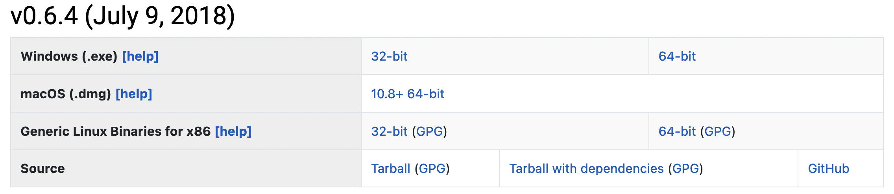

# cNODE

This repository contains the code associated with the paper: "Predicting microbiome compositions from species assemblages through deep learning" (doi: https://doi.org/10.1101/2021.06.17.448886).


### Julia
Download: Julia 0.6.4 from the [GitHub repository](https://github.com/JuliaLang/julia/tree/v0.6.4) or the [webpage](https://julialang.org/downloads/oldreleases/) at:



### Package versions

For installing the packages, run:

```
Pkg.add("DiffEqFlux", v"0.7.0")
Pkg.add("DifferentialEquations", v"6.9.0")
Pkg.add("Distances", v"0.8.2")
Pkg.add("Distributions", v"0.19.2")
Pkg.add("Flux", v"0.9.0")
Pkg.add("MLDataPattern", v"0.5.3")
Pkg.add("StatsBase", v"0.33.0")

pkgs_names = [
    "DelimitedFiles", "Random", "Statistics", "LinearAlgebra",
    "Distributed", "SharedArrays", "Combinatorics"
    ]

Pkg.add.(pkgs_names)

```

### Usage

For generating synthetic data using the GLV model, run:

```
julia test_syntetic_generation.jl
```

This will create the folder `test_data` and save the parameters, species collections and steady-states.

For running the hyperparameter search run:

```
julia test_hyperparameter_search.jl
```

This will create the folder `test_data/Hyperparameters` with the results of a leave-one-out cross validation.

To validate the performance of cNODE using this hyperparameters, run:

```
julia test_syntetic_validation.jl
```

This will create the folder `test_results` with the training and test loss for every dataset.

---
### Reproducing results

The datasets analyzed on our paper are under `Data/` and the results under `Results/`. To produce the figures of the paper, the Mathematica code is under the folder `Figures/`.
